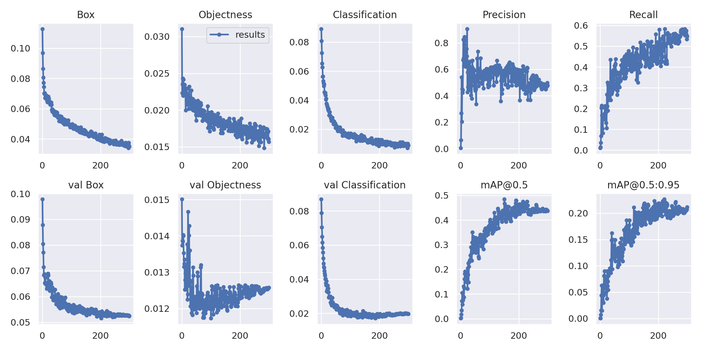
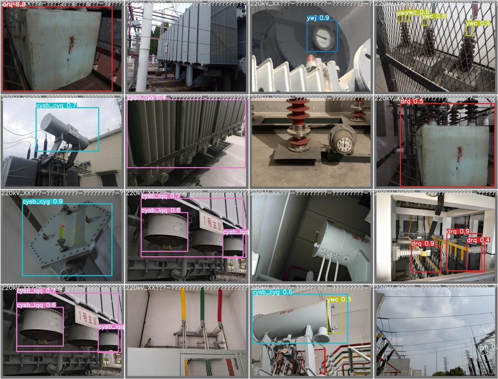

# Defect-Detection-yolov7

  This project is based on yolov7 project. The original project can be found [here](https://github.com/WongKinYiu/yolov7)

  This model are designed for a subproject of defect detection. It can detect Multiple equipment components in single image or video stream.

## Requirements

- Python 3.8 or later with all [requirements.txt]
- PyTorch 1.7.0 or later with CUDA and torchvision

### create virtual environment

  ```bash
  python -m venv Defect-Detection
  source Defect-Detection/bin/activate 
  ```

### install requirements

  ```bash
  cd $project_path
  pip install -r requirements.txt
  ```

## Raw data processing

  Data should store in yolov7-format dir tree as follow:

  ```markdown
yolov7_data
└── sub_yolo_data
    ├── test
    │   ├── images
    │   └── labels
    └── train
        ├── images
        └── labels
  ```

  Where images should be .jpg format and labels should be yolo .txt format.

  For raw data in 缺陷识别 folder, way to process data is as follow:

### Seperate mixed data

  In each data folder,images(.jpg files and .JPG files) and labels(.txt files) are mixed together. We need to seperate them into two folders and rename them.

#### Code for replacing space with underscore

  ```bash
  data_dir="~/Documents/Defect-Detection-yolov7/data/缺陷识别raw/设备部件识别"
  cd $data_dir
  for f in *; do mv "$f" `echo $f | tr ' ' '_'`; done
  ```

#### Code for seperating images and labels

  ```bash
  data_dir="~/Documents/Defect-Detection-yolov7/data/缺陷识别raw/设备部件识别"
  touch mvjpg.txt
  touch mvxml.txt
  find $data_dir -iregex .*\.jpg    > mvjpg.txt
  find $data_dir -iregex .*\.xml    > mvxml.txt
  mkdir $data_dir/images
  mkdir $data_dir/labels
  for i in $(cat mvjpg.txt); do (mv $i $data_dir/images); done
  for i in $(cat mvxml.txt); do (mv $i $data_dir/labels); done
  rm mvjpg.txt
  rm mvxml.txt
  ```

### Deal with images with wrong label in the dataset

  Labeling errors are common in the dataset, so we need to deal with them.
  For some  unknown reason, labels of some images are rotated by 90 degrees(seems randomly clockwise or counterclockwise).

  ```bash
  # find the images with wrong label
  python data/wrong_size.py
  ```

  The outout is a txt file with the path of images with wrong label.including rotated images and images with incorrect label for other reasons.then seperate them from the dataset.

  ```bash
  data_dir="/Users/wzilai/Documents/Defect-Detection-yolov7/data/缺陷识别raw/设备部件识别"
  mkdir $data_dir/bad_examples/images
  mkdir $data_dir/bad_examples/labels
  for i in $(cat $data_dir/wrong_size.txt); do mv $data_dir/images/$i $data_dir/bad_examples/images; done
  for i in $(cat $data_dir/wrong_size.txt); do mv $data_dir/labels/$i $data_dir/bad_examples/labels; done
  ```

  You can fix the label of these images manully or just use the remaining images to train the model.

### Change label format

  raw labels are stored in xml format,but yolo model need input in yolo-format.
  prepare.py can change xml format to yolo-format and separate data into train set and validation set.
  before run prepare.py, you need to change class name and yolo-format dir name in prepare.py. dir create is not fully-automatic in prepare.py, you need to create dir by yourself for now.

#### data dir tree

  ```markdown
yolov7_data
└── sub_yolo_data
    ├── test
    │   ├── images
    │   └── labels
    └── train
        ├── images
        └── labels
  ```

### Create yaml file

  yaml file is used to record the project information.
  After run prepare.py, create yaml file for dataset, then change train/test image path and class name in yaml file. train.py will automatically read yaml file, and find labels.

#### Sample yolov7 yaml file

  ```yaml
train: ./data/dataset/train.txt or ./data/dataset/train
val: ./data/dataset/val.txt or ./data/dataset/val
test: ./data/dataset/test.txt or ./data/dataset/test
#txt files were auto generated by prepare.py
# Number of classes
nc: 3
# Class names
names: ['cat', 'dog', 'person']
  ```

## training

### track and visualize

#### yolov7

  ```python
  !pip install wandb
  import wandb
  wandb.login()
  ```

  If you get fresh copy from yolov7 github, please modifie Defect-Detection-yolov7/utils/google_utils.py
  **delete dtype=np.int32 in cum_counts = np.cumsum(np.greater(counts, 0, dtype=np.int32)) or change int32 to float32**
  because this typecheck will cause error in wandb

### train

  ```bash
!python train.py --epochs 300 --data 设备部件识别_without_ddjt_yx_tg.yaml --weight yolov7-tiny.pt --batch-size 16 --freeze 50 --hyp data/hyp.scratch.tiny.yaml

  ```

  you can change hyperparameters in hyp.yaml file.

  result for 300 epochs:
  

  ```markdown
6085                  all         215         221       0.478       0.548       0.436       0.211
6086             cysb_sgz         215           2       0.129         0.5       0.108      0.0557
6087               SF6ylb         215           1       0.512           1       0.995       0.498
6088                  drq         215          55       0.433       0.327       0.194      0.0742
6089                ecjxh         215           5       0.408         0.8       0.524       0.241
6090                drqgd         215           7       0.207       0.286       0.116      0.0659
6091             cysb_lqq         215          21       0.453       0.619        0.48         0.2
6092           cysb_qtjdq         215           6       0.437           1       0.828       0.371
6093                xldlb         215          22        0.66           1        0.98       0.477
6094                  ywj         215           1       0.204           1       0.498       0.299
6095                jdyxx         215          13       0.481       0.154       0.116      0.0195
6096                fhz_f         215           1           1           0           0           0
6097                 bmwh         215           3           0           0       0.112      0.0335
6098               xmbhzc         215           3           1       0.664       0.736       0.442
6099                  pzq         215          19       0.478       0.842       0.687       0.308
6100                  jyh         215          20       0.478         0.8       0.705       0.366
6101                  ywc         215          11       0.118       0.182       0.144      0.0641
6102             cysb_cyg         215          30       0.598       0.695       0.634       0.292
6103                 bjzc         215           1           1           0           0           0
  ```

### Detect

  ```bash
!python detect.py  --weights runs/train/exp10/weights/best.pt --source data/缺陷识别yolov7/设备部件识别_without_ddjt_yx_tg/test/images
  ```

  ```markdown
  Usage - sources:
      --source 0                               # webcam
              img.jpg                         # image
              vid.mp4                         # video
              screen                          # screenshot
              path/                           # directory
              list.txt                        # list of images
              list.streams                    # list of streams
              'path/*.jpg'                    # glob
              'https://youtu.be/Zgi9g1ksQHc'  # YouTube
              'rtsp://example.com/media.mp4'  # RTSP, RTMP, HTTP stream
  ```

### Example

